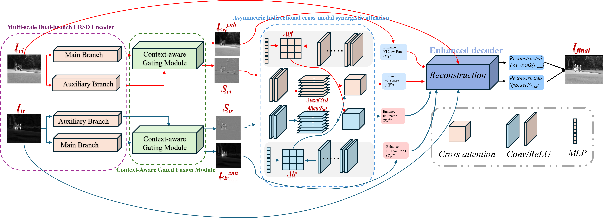
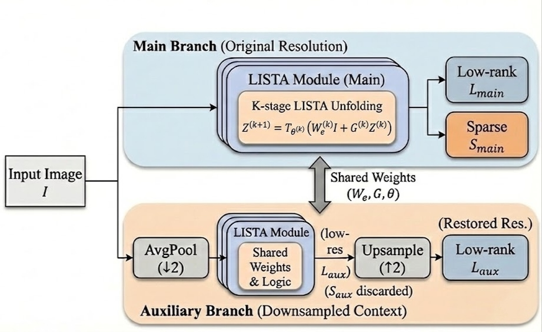
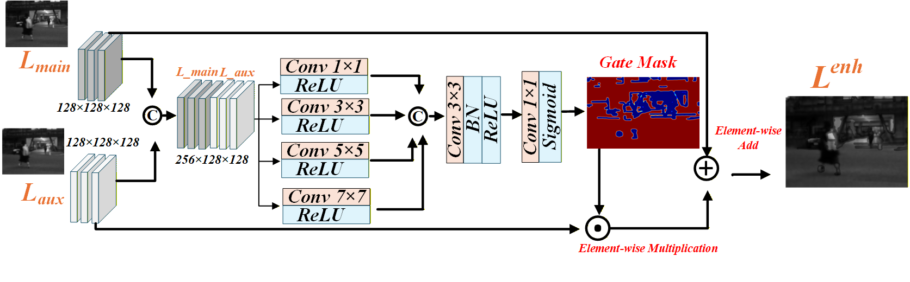
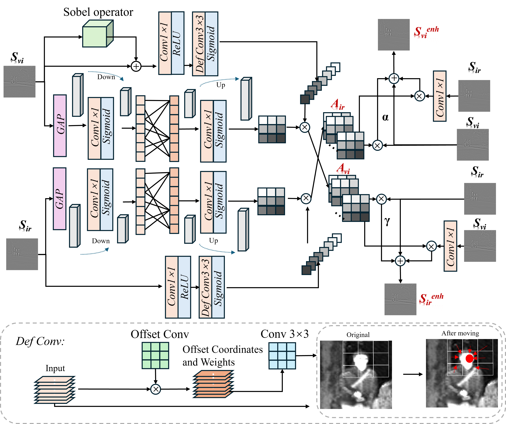
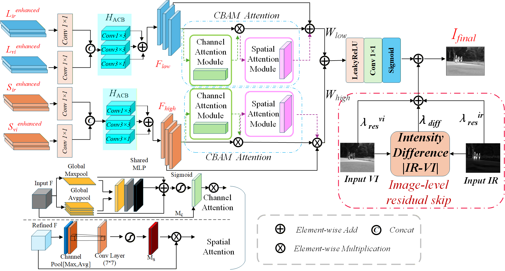

# DULRNet: A Deep Unfolding Low-Rank Network for Infrared and Visible Image Fusion

DULRNet is a deep unfolding low-rank network for infrared and visible image fusion. It unfolds the Low-Rank Sparse Decomposition (LRSD) optimization process into a learnable neural architecture, so that infrared thermal targets and visible texture structures can be modeled in a more interpretable way.

The network is designed to preserve the complementary advantages of both modalities: infrared images provide salient thermal radiation responses, while visible images contain richer structural and texture details. DULRNet combines multi-scale decomposition, gated context filtering, asymmetric cross-modal attention, and enhanced reconstruction to generate a fused image with clear targets and abundant textures.

<p align="center">
  
</p>

## Framework

DULRNet contains three main stages. First, a multi-scale dual-branch LRSD encoder decomposes infrared and visible images into low-rank background and sparse detail components. Then, cross-modal interaction is performed through context-aware gated fusion and asymmetric bidirectional attention. Finally, an enhanced decoder reconstructs the fused image with frequency-aware refinement and residual compensation.

### Main Components

**Multi-scale dual-branch LRSD encoder.** This module unfolds the iterative LRSD process into learnable stages. The main branch works at the original resolution to preserve fine spatial details, while the auxiliary branch captures broader contextual information through downsampling. The two branches share weights to encourage scale-consistent representations.

<p align="center">
  
</p>

**Context-aware gated fusion module.** Directly merging multi-scale features may introduce redundant or noisy information. The gated fusion module learns spatially adaptive masks to filter auxiliary low-rank features and reduce cross-scale interference before reconstruction.

<p align="center">
  
</p>

**Asymmetric bidirectional cross-modal attention.** Infrared and visible images carry different physical priors. This module uses asymmetric cross-modal guidance to strengthen infrared saliency and visible structural gradients in a differentiated way, helping the network reduce modality conflict while retaining complementary information.

<p align="center">
  
</p>

**Enhanced decoder.** The decoder aggregates enhanced low-rank and sparse representations and reconstructs the final fused image. It uses feature refinement and residual compensation to preserve thermal intensity and visible texture details.

<p align="center">
  
</p>

## Environment

The code was trained and tested with Python 3.9, PyTorch 2.8.0, TorchVision 0.23.0, and CUDA 12.8. The required packages are provided in `environment.yaml`:

```bash
conda env create -f environment.yaml
conda activate dulrnet
```

## Dataset

[MSRS](https://github.com/Linfeng-Tang/MSRS) is utilized to train DULRNet. During training, paired infrared and visible images are cropped into 128 x 128 patches.

[vgg-16](https://drive.google.com/file/d/1l3ieFhtgXd_R0alXr42RNQUTy1GSeNBg/view?usp=drive_link) was used to extract perceptual features for feature and style constraints.

## Training

Train DULRNet with:

```bash
python training_dulrnet.py
```

## Testing

Test DULRNet with:

```bash
python testing_dulrnet.py
```

The fusion results will be saved in `outputs/DULRNet`.

## Contact

If you have any questions, please contact wangdongming@whut.edu.cn.
